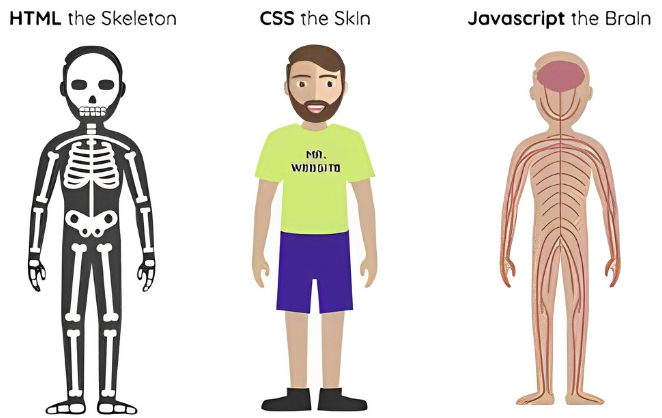
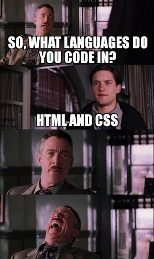
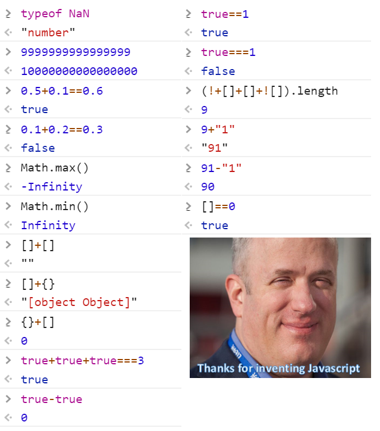
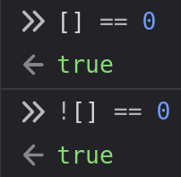

<!-- _class: lead -->

<style>
section {
  justify-content: flex-start;
}
section.lead {
  justify-content: center;
}
section.lead > h1 {
  font-size: 3rem;
}
ul {
  margin-bottom: 1rem;
}
section.html-css-js {
    text-align: center;
}
section.html-css-js > ul {
    display: flex;
    list-style: none;
}
section.html-css-js > ul > li {
    flex: 1;
}
section.html-css-js > ul > li > ul {
    font-size: 0.8rem;
    text-align: left;
}
section > div.code-img {
    display: flex;
    gap: 1rem;
}
section > div.code-img > :first-child {
    flex: 1;
}

</style>

# Waffle Studio Frontend Seminar - 0

---

# Instructor

안중원

- 컴퓨터공학부 21학번
- 와플스튜디오 19.5기
- 2022 와플스튜디오 프론트엔드 세미나 진행
- 현재 3학년 재학중

---

# 커리큘럼

- 세미나 0: HTML, CSS, JS
- 세미나 0.5: Typescript
- 세미나 1: React component, state, 배포
- 세미나 1.5: 함수형 프로그래밍, CSS 레이아웃
- 세미나 2: Lifecycle, hooks, context API, routing
- 세미나 3: 비동기, 네트워크
- 세미나 4: React 심화, CSS 편하게 쓰기, 성능
- 세미나 5: 웹의 역사, CSR, SSR, SSG, MPA, SPA

---

# 진행

- 대면+비대면 하이브리드 진행
- 녹화본은 (아마) 유튜브로 업로드합니다
  - 까먹고 녹화 안 할 수도 있음

---

# 진행

- 장소
  - 세미나 전날까지 공지합니다
  - 아마 301동에서 진행할 예정입니다
- 시간
  - 격주 금요일 8시?
  - (.5 세미나가 끼면 거의 매주)
  - 지금 정해봅시다

---

# 질문하기

- 세미나 중: 아무때나
  - 중간중간 멍석도 깔아드립니다
- 세미나 외: 슬랙 / 깃허브 이슈
  - 질문 올리기 전에 구글링 + 기존 이슈 한번만 확인합시다

---

# 출석

- 세미나 끝날 때 즉흥적으로 정해지는 출석 코드를 알려드립니다
- 3번 이상 무단 결석하면 탈락 처리합니다
- 세미나 참석이 어려운 경우 24시간 이전에 미리 알려주세요

---

<!-- _class: lead -->

# 개요

---

# 개요

- 세미나 소개
- 프론트엔드
- HTML
- CSS
- Javascript

---

<!-- _class: lead -->

# 프론트엔드

---

# 프론트엔드

- 사용자가 직접 보고 조작하는 화면
- 이 세미나에서는 웹서비스에서 웹 브라우저로 접속하는 페이지를 가리킴
- UI/UX에 대한 고민이 필요 -- 어떻게 만들어야 사용자가 쓰기 편한가?
  - 크로스 브라우징
  - 웹 접근성
  - 보안

---

<!-- _class: html-css-js -->

- **HTML**
    - 페이지의 구조, 의미를 부여하는 정적 언어
    - 웹의 구조를 담당
    - 이쁘게 만들려고 시도 X
    - 온전히 구조를 만드는 데 집중
- **CSS**
    - 크기, 폰트, 레이아웃 등을 지정하여 콘텐츠를 꾸며주는 정적 언어
    - 웹의 시각적인 표현을 담당
    - 적당한 크기와 색상, 원하는 위치를 지정하는데 집중
- **Javascript**
    - 페이지를 동적으로 꾸며주는 역할을 하는 프로그래밍 언어
    - 웹의 동적 처리를 담당



---

<!-- _class: lead -->

# HTML



---

# HTML

*HyperText Markup Language*

- 웹페이지의 구조와 내용을 나타내기 위한 언어

```html
<!DOCTYPE html>
<html>
  <head>
    <title>서시</title>
  </head>
  <body>
    <h1>서시</h1>
    <p>하늘을 우러러 한 점 부끄럼이 없기를</p>
    
  </body>
</html>
```

---

# HTML

- 알아둘 만한 태그:
  - 구획 및 스타일 지정: div, span
  - 특별한 의미(귀찮은 기본 스타일): ul & li, hr, h1 ~ h6, p
  - 특별한 의미(스타일 없음): header, main, section, article, time, aside, footer
  - 특별한 기능: a, button, input, form, img, label, textarea
- 각 태그를 의미와 기능에 맞게 사용하는 것이 중요
- [한눈에 보는 HTML 요소(Elements & Attributes) 총정리](https://heropy.blog/2019/05/26/html-elements/)

---

# 예제

- 이 슬라이드의 HTML도 까볼 수 있다!

---

# Q & A

---

<!-- _class: lead -->

# CSS


---

# CSS

*Cascading StyleSheet*
- 웹페이지를 꾸미기 위한 언어

```html
<h1 style="color: red">붉은 노을</h1>

<style>
p {
  color: red;
}
</style>
<p>저 대답 없는 노을만 붉게 타는데~</p>
```

---

# 선택자


<div style="display: grid; grid-template-columns: 1fr 0.6fr">

<div>

*무엇을 꾸밀 것인가?*
- 스타일을 적용할 HTML 요소를 선택한다
- 태그로 찾기  / 클래스로 찾기 / id로 찾기
- 선택자를 조합하여 여러 조건을 동시에 적용하는 것도 가능

</div>
<div>

```html
<div>
    <h1>제목...</h1>
    <p class="description">본문...</p>
    <button id="click-me">버튼</button>
</div>
```
```css
h1 {
   color: red;
}

.description {
   color: blue;
}

#click-me {
   border: solid;
}
```

</div>
</div>

---

# 속성(property)

*어떻게 꾸밀 것인가?*
- 속성도 대단히 많다
- position, margin, justify-content, display, line-height, text-align, padding, box-sizing, width, height, color, background-color, border-radius, ...
- 그때그때 구르면서 배우는 게 빠르다
  - 세미나장도 맨날 검색함

---

# Q & A

---

<!-- _class: lead -->

# Javascript



---

# Javascript

- 페이지를 동적으로 제어하는 프로그래밍 언어
- 문법은 C언어나 Java와 유사
- 난이도는 파이썬과 유사
- 동적 타입 언어

```javascript
let x = 1;
const arr = [1, 2, 3, 4, 5];
for (let i = 0; i < 5; ++i) {
  console.log(arr[i]);
}

function add(a, b) {
  return a + b;
}
```

---

# 눈여겨볼 포인트

- 함수형 프로그래밍
- 타입 몰래 바뀜: Implicit type casting
- 오브젝트 및 배열 복사: Spread & Rest
- Destructure
- 화살표 함수
- DOM

---

# 함수형 프로그래밍

```javascript
students
  .filter((student) => student.grade === 3)
  .forEach((student) => console.log(student.name));
```

---

# Implicit type casting

- 사칙연산을 비롯한 여러 연산자를 사용하면 자바스크립트는 아무 예고도 없이 타입을 바꿔버린다
- 일단은 항상 `==`와 `!=` 대신`===`와 `!==`를 쓰도록 하자
- 다음 세미세미나에서 다룰 타입스크립트를 통해 이러한 버그를 대부분 잡을 수 있다
  - 타입스크립트가 de facto standard



---

# Spread & Rest

```javascript
const todo = { text: "yay" };
const complexTodo = { ...todo, isComplex: true };

console.log(complexTodo); // { text: "yay", isComplex: true }


const todos = [{ text: "wow" }, { name: "lol" }];
const tooManyTodos = [...todos, todo];

console.log(tooManyTodos); // [{ text: "wow" }, { text: "lol" }, { text: "yay" }]
```

---

# Destructure

```javascript
const todo = { text: "heh", isComplex: false };

function whatShouldIDo({ text }) {
  console.log("todo: " + text);
}

whatShouldIDo(todo); // todo: heh
```

---

# 화살표 함수

```javascript
list.map(function(value) {
  return value * 2;
});

list.map((value) => value * 2);
```

---

# DOM

- Document Object Model
- Javascript로 HTML 요소를 조작하기 위한 API

- React 하면서 직접 쓸 일은 잘 없지만, React도 내부적으로는 DOM을 사용한다

- [MDN 괴롭히기](https://developer.mozilla.org/ko/docs/Web/API/Document_Object_Model/Introduction)
```javascript
const search = document.getElementById("top-nav-search-input");
alert(`search = ${search.value}`);

const footer = document.getElementById("nav-footer");
footer.addEventListener("click", () => {
  alert("footer clicked");
});
```

---

# Q & A

---

<!-- _class: lead -->

# 과제

---

# 과제

[과제 문서](./hw.md) 참조

---

# 참고할만한 자료

[HTML 요소 총정리](https://heropy.blog/2019/05/26/html-elements/)
[CSS 개요](https://happy-noether-c87ffa.netlify.app/presentations/level1/css/summary/)
[CSS 속성](https://happy-noether-c87ffa.netlify.app/presentations/level1/css/properties/)

---

# 과제 제출

百聞이 不如一見
